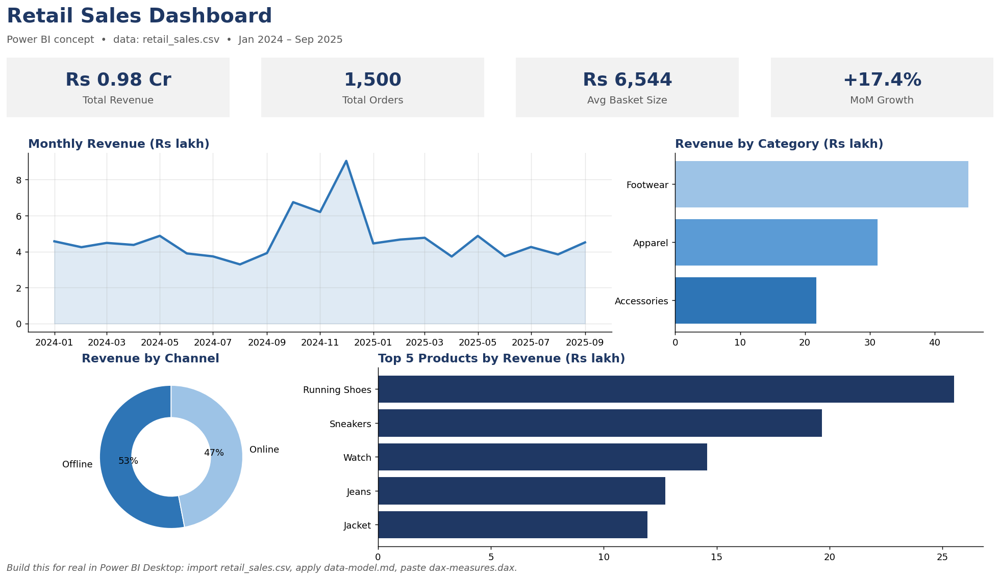

# Power BI Retail Dashboard 🛍️

> **A complete Power BI project kit for a retail sales dashboard: sample dataset, star-schema data model, production-ready DAX measures, and a dashboard layout mockup — everything a client needs to see what they'll get.**

## What's inside

| File | What it is |
|---|---|
| `data/retail_sales.csv` | 1,500 synthetic transactions (Jan 2024 – Sep 2025): orders, stores, products, channels |
| `data-model.md` | Star-schema design doc: tables, relationships, mermaid ER diagram, Power Query notes |
| `dax-measures.dax` | 13 real DAX measures — YTD, MoM/YoY growth, Top-N products, channel share, dynamic segmentation, store ranking |
| `dashboard-mockup.png` | The dashboard layout: 4 KPI cards, monthly trend, category bars, channel donut, top-5 products |
| `generate_data.py` / `make_mockup.py` | Scripts that build the dataset and the mockup (reproducible) |

## The build a client gets

1. **Import** `retail_sales.csv` into Power BI Desktop (free).
2. **Model** per `data-model.md`: fact `Sales` + dimensions `Calendar`,
   `Products`, `Stores`; mark `Calendar` as the date table.
3. **Paste** the measures from `dax-measures.dax` (Modeling → New measure).
4. **Lay out** visuals per `dashboard-mockup.png`: KPI cards on top, trend and
   breakdowns below, slicers for Store / Category / Channel / Month.

## Power BI skills demonstrated

- **Data modeling:** star schema, fact/dimension separation, generated date table
- **DAX:** `CALCULATE` filter context, time intelligence (`DATESYTD`,
  `PREVIOUSMONTH`, `SAMEPERIODLASTYEAR`), `TOPN`, `RANKX`, `DIVIDE` for
  zero-safe math, calculated-column segmentation
- **Dashboard design:** KPI-first layout, consistent ₹ formatting, one-glance
  channel mix and product ranking

## For clients

This kit is the blueprint I deliver for retail, e-commerce, and franchise
reporting: your sales export in, an interactive dashboard out — drill from
year → quarter → month → store, with measures your team can audit and extend.

## License

MIT — use it, fork it, sell services built on it.

## ☕ Support my work
If this project was useful, you can support it with Bitcoin: `bc1q6q75k8zjxvw7w02lmdprpy6xx6qk4lzz2rmvay`
