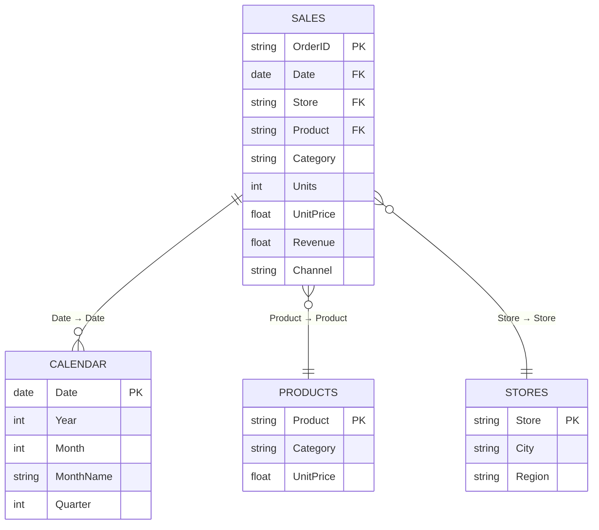

# Data model — star schema

The model behind the dashboard. One fact table, three dimension tables.
Build it in Power BI Desktop with **Model view**, or replicate it in any
warehouse (the grain is one row per order line).

## Tables

| Table | Type | Key | Columns |
|---|---|---|---|
| `Sales` | Fact | `OrderID` | OrderID, Date, Store, Product, Category, Units, UnitPrice, Revenue, Channel |
| `Calendar` | Dimension | `Date` | Date, Year, Month, MonthName, Quarter, IsWeekend |
| `Products` | Dimension | `Product` | Product, Category, UnitPrice |
| `Stores` | Dimension | `Store` | Store, City, Region |

`Calendar` is a generated date table (2024-01-01 → 2025-12-31) — never use the
fact's raw date column for time intelligence. `Products` and `Stores` are
derived with **Remove Duplicates** in Power Query.

## Relationships (all single-direction, fact → dimension)

## Power Query notes

- `Revenue` is a computed column in the fact (`Units * UnitPrice`) — keep the
  raw inputs so the measure stays auditable.
- Set `Revenue` / `UnitPrice` to **Currency (₹, 0 decimals)**, `Date` to Date.
- Mark `Calendar` as the official **date table** (Table tools → Mark as date table)
  so YTD / MoM time intelligence works.

## Cardinality sanity checks (add as DAX or Power Query steps)

- `Sales[OrderID]` unique: 1,500 rows → 1,500 distinct.
- No nulls in any key column.
- `Calendar` covers every `Sales[Date]` (no orphan fact rows).
